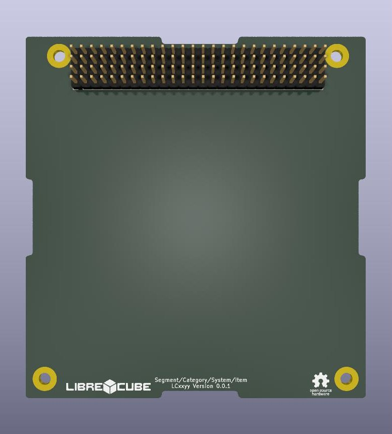

# LibreCube Board Template

This repository contains the templates of the PC/104-alike LibreCube board.
The electrical template was made with [KiCad](https://www.kicad.org/), whereas the mechanical template was made with [FreeCAD](https://www.freecad.org/).

You may use the templates to develop boards for the [LibreCube open source ecosystem](https://librecube.gitlab.io/).

You may also use the templates to develop your own, commercial or non-commerical, boards. In such case however, you **MUST** remove any LibreCube logo from your board.

## Documentation

Find the full board specification here:
https://librecube.gitlab.io/standards/board_specification/

## Contribute

- Issue Tracker: https://gitlab.com/librecube/support/templates/librecube-board/-/issues
- Source Code: https://gitlab.com/librecube/support/templates/librecube-board

To learn more on how to successfully contribute please read the contributing
information in the [LibreCube guidelines](https://gitlab.com/librecube/guidelines).

## Support

If you are having issues, please let us know. Reach us at
[Matrix](https://app.element.io/#/room/#librecube.org:matrix.org)
or via [Email](mailto:info@librecube.org).

## License

The project is licensed under the CERN Open Hardware license. See the [LICENSE](./LICENSE.txt) file for details.
