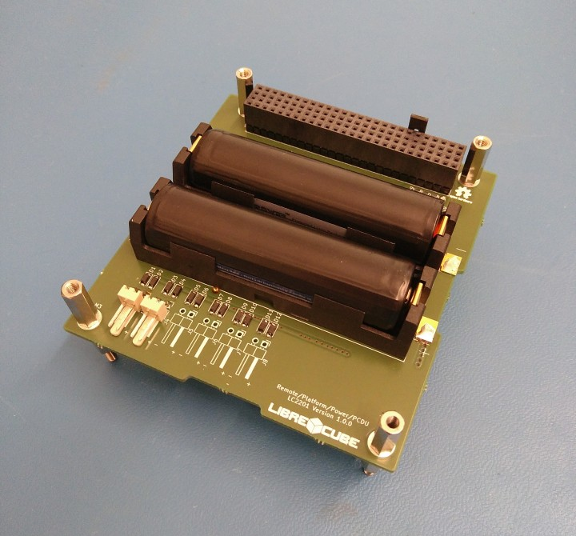

# LibrePlatform / Power / Power Control and Distribution Unit

This is a basic Power Conditioning and Distribution Unit (PCDU) that
implements a full redundancy scheme and adheres to the LibreCube board
specification. The main features are:

- Input connectors for up to six solar cells (in configurations for up to 5 Volt)
- Conditioning of input power (linear energy transfer mode)
- Two Li-Ion batteries integrated on board
- Charge and discharge circuitry for batteries, depending on solar input and load
- Main power switch that disconnects all electrical loads from solar cell input and batteries
- Stable 5 Volt output power to attached loads
- Four output switches fro switchable loads

## How to Build

The **/build** folder contains:
- the schematic of the circuitry as reference
- the PCB layout (Gerber format) for board manufacturing
- the bill of materials (BOM) for ordering components

## How to Modify

The **/src** folder contains the [KiCAD](https://www.kicad.org/) source files
of the board.

## Documentation

See the [Documentation](docs/index.md) for detailed information.

## Contribute

- Issue Tracker: https://gitlab.com/librecube/elements/LC2201A/-/issues
- Source Code: https://gitlab.com/librecube/elements/LC2201A

To learn more on how to successfully contribute please read the contributing
information in the [LibreCube Guidelines](https://librecube.gitlab.io/).

Want to get involved? Join us at [Matrix](https://app.element.io/#/room/#librecube.org:matrix.org)
or via [Email](mailto:info@librecube.org).

## License

The project is licensed under the CERN Open Hardware license.
See the [LICENSE](./LICENSE.txt) file for details.
