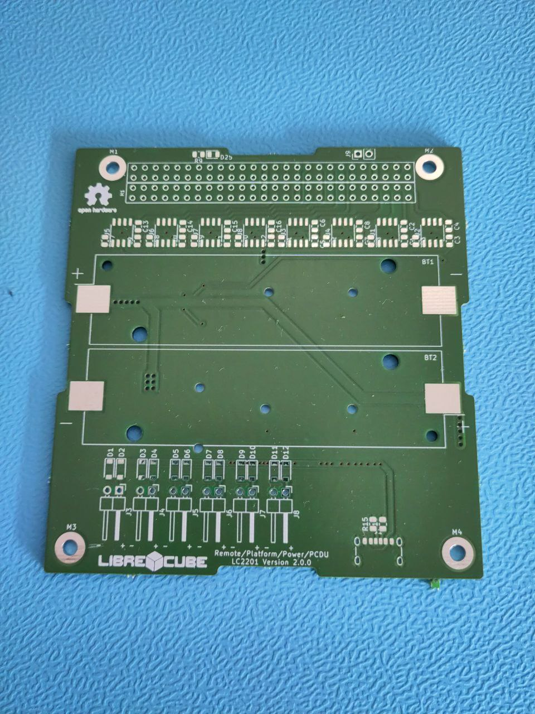
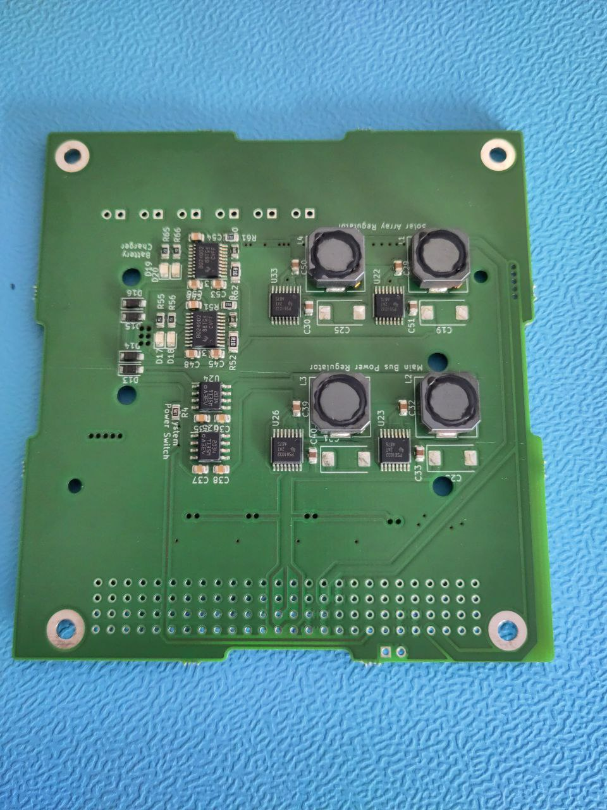
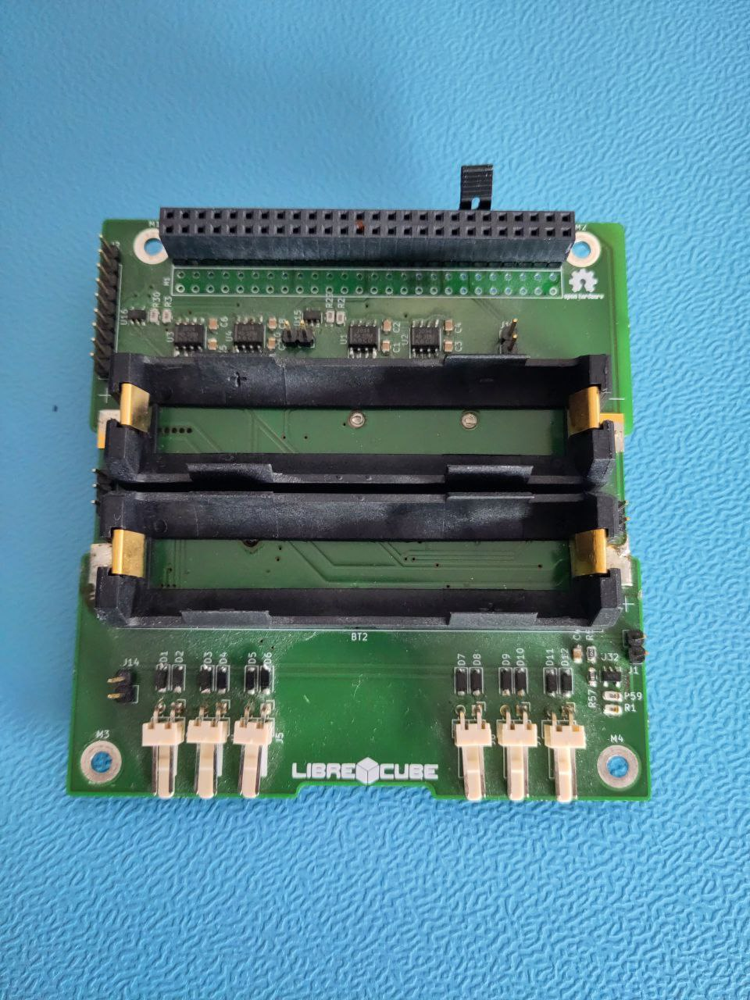

# Assembly Guide

## Tools

You need soldering equipment if you intend to solder the components manually.

## Parts to buy

You need to buy the components to be soldered into the PCB. The list of
components is in the `bom.csv` file in the `build` folder.

Further, you need two Li-Ion batteries of type 18650.

## Parts to produce

Send the KiCAD PCB file to a PCB manufacturer of your choice. Or create the PCB
by yourself, if you have the equipment.

## Instructions

### 1. Prepare PCB

### 2. Solder SMD components

### 3. Solder battery holder and connectors

