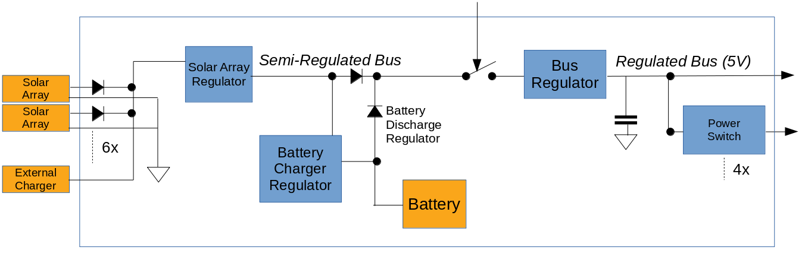

# LibrePlatform - Power - Power Control and Distribution Unit

## Overview

The LibreCube Power Conditioning and Distribution Unit (PCDU) is the unit that
provides reliable and continuous power to attached units. The PCDU is designed
to be fully redundant, such that failure of any single component will not lead
to loss of the system. Typically its purpose is to be the main power supply
of a system, such as satellite, rover, or drone.

Solar panels must be connected in order to re-charge the batteries. One or two
Li-Ion batteries can be mounted easily in the battery holder of the board.

The block diagram of the PCDU is shown below. The sections below provide more
information on the modules.

## Solar Array Regulator (SAR)

Up to six solar arrays can be connected to the board. They are combined in parallel
and input to the solar array regulator. The SAR uses a direct energy transfer
to drive its internal boost converter to output stable 5V into the semi-regulated
bus and into the battery charge regulator.

## Battery Charge Regulator (BCR)

When there is power from the SAR on the semi-regulated bus that exceeds the
needs of the output loads, the BCR will use it to charge the batteries.

## Batter Discharge Regulator (BDR)

There is no specific module implemented for the BDR. Instead, the semi-regulated
bus is fed from the batteries directly when there is not sufficient power from the SAR.

## Battery Holder

One or two Li-Ion batteries can be placed in the battery holder. When two batteries
are mounted, they are connected in parallel. The batteries provide power during
times when no power is available from the solar array inputs, or when the power
from the solar arrays is not sufficient to supply the attached loads.

## Main System Switch

The purpose of the main system switch is to completely power off output loads.
For this, the switch disconnects the semi-regulated bus from the main bus regulator.
Typically this is used either for system power cycle, or for power off during
storage and transport (including launch).

## Main Bus Regulator (MBR)

The main bus regulator provides a stable 5 Volt output at around 1 Watt. It is
powered by the SAR when solar power is available or from the BDR when there is
no power from the SAR or the power from SAR is not sufficient.

## Output Power Switches

Four output power switches allow control the power state of attached loads.
Whereas the main 5 Volt power line is permanently on, the switchable lines
allow for on/off through dedicated lines.

## LibreCube CubeSat Connector

The board provides the standard Samtec connector used on most CubeSats. It uses
only a minimum number of pins of the connectors and adheres to the LibreCube
board specification.
